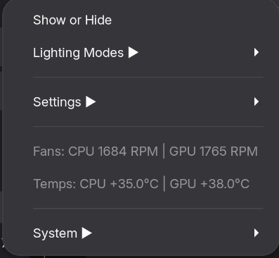
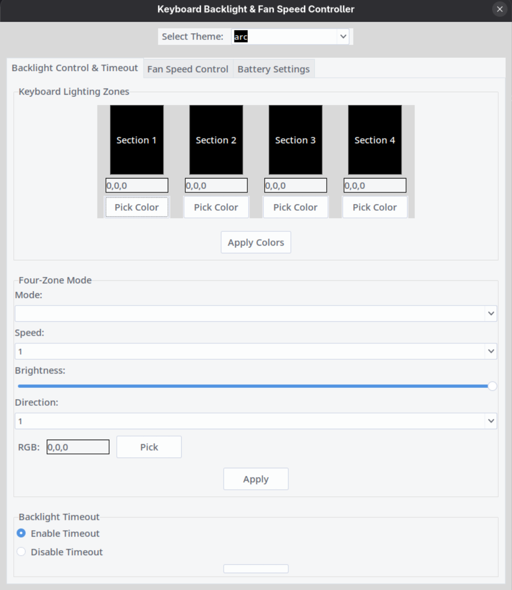

# Linuwu Sense Control

A GUI application for controlling Acer Predator hardware features (keyboard lighting, fan speeds, etc.) on Linux.

Tray icon:




GUI(Needs improvents):




## Features
- Keyboard backlight control 
- Fan speed control 
- Battery limiter toggle
- System tray integration
- Real-time temperature monitoring

## Installation

### 1. Prerequisites

#### Arch Linux:
```bash
sudo pacman -S python python-pip tk gtk3 gobject-introspection libappindicator-gtk3
```
### Ubuntu/Debian:
```bash
sudo apt install python3 python3-pip python3-tk python3-gi python3-gi-cairo gir1.2-appindicator3-0.1
```

### 2. Install Python Dependencies
```bash
git clone https://github.com/yusifvatan/GUI-for-Linuwu-Sense.git
cd linuwu-sense
python -m venv venv
source venv/bin/activate
pip install -r requirements.txt
```
### 3. Hardware Access Configuration
```bash
sudo tee /etc/udev/rules.d/99-linuwu.rules <<EOF
SUBSYSTEM=="platform", KERNEL=="acer-wmi", MODE="0666"
SUBSYSTEM=="hwmon", ATTR{name}=="acer_wmi", MODE="0666"
EOF

sudo udevadm control --reload
sudo udevadm trigger
```
### 4. Systemd Service (Autostart)
Create new file at ~/.config/systemd/user/linuwu-sense.service
```bash
[Unit]
Description=Linuwu Sense Control
After=graphical-session.target

[Service]
ExecStart=$PWD/venv/bin/python $PWD/linuwu_sense.py
Restart=always
Environment="DISPLAY=:0"
Environment="XAUTHORITY=%h/.Xauthority"

[Install]
WantedBy=graphical-session.target
EOF
```
Activate service
```bash
systemctl --user enable --now linuwu-sense
```
## Usage
Launch manually:
```bash
./linuwu_sense.py
```
Toggle window visibility via system tray icon

Configure fan speeds and lighting in the GUI

## Uninstallation
```bash
systemctl --user disable --now linuwu-sense
rm ~/.config/systemd/user/linuwu-sense.service
sudo rm /etc/udev/rules.d/99-linuwu.rules  # If using udev rules
```


